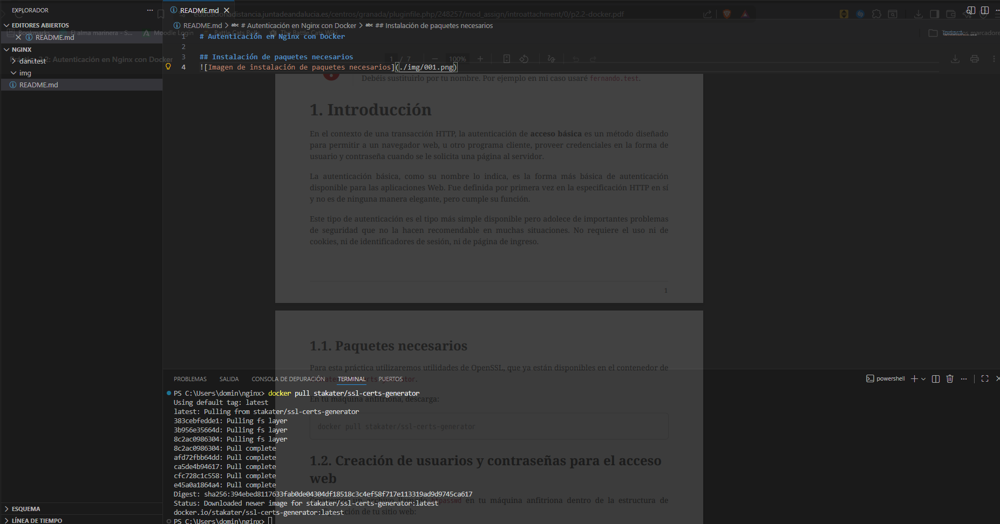
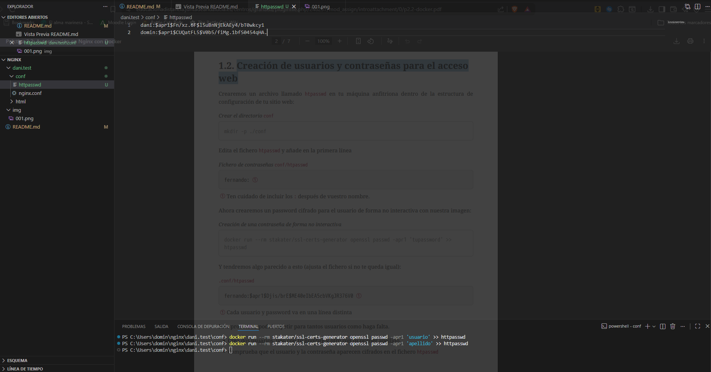
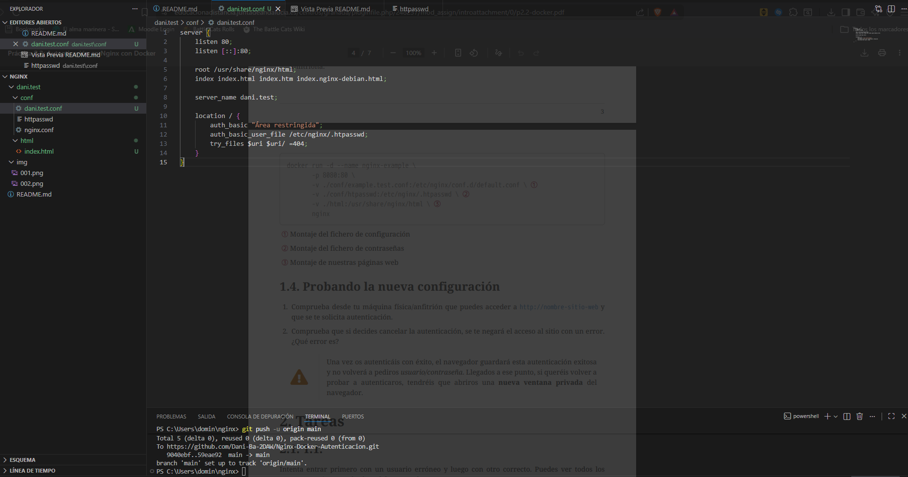
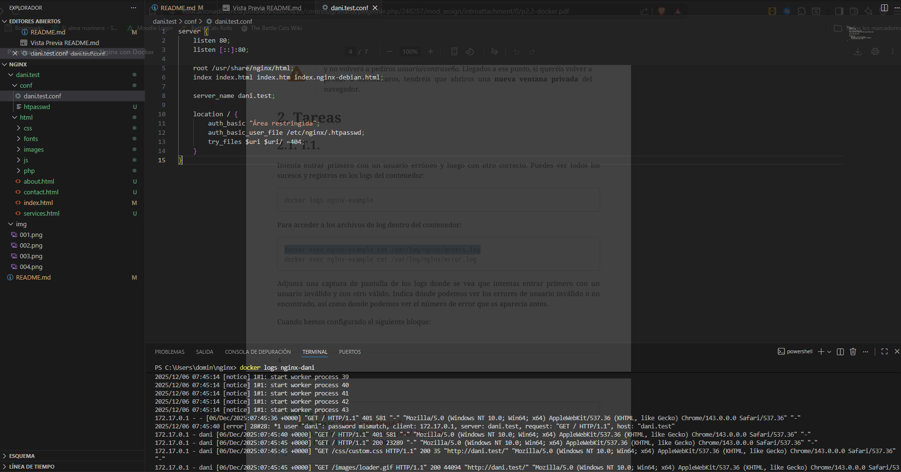
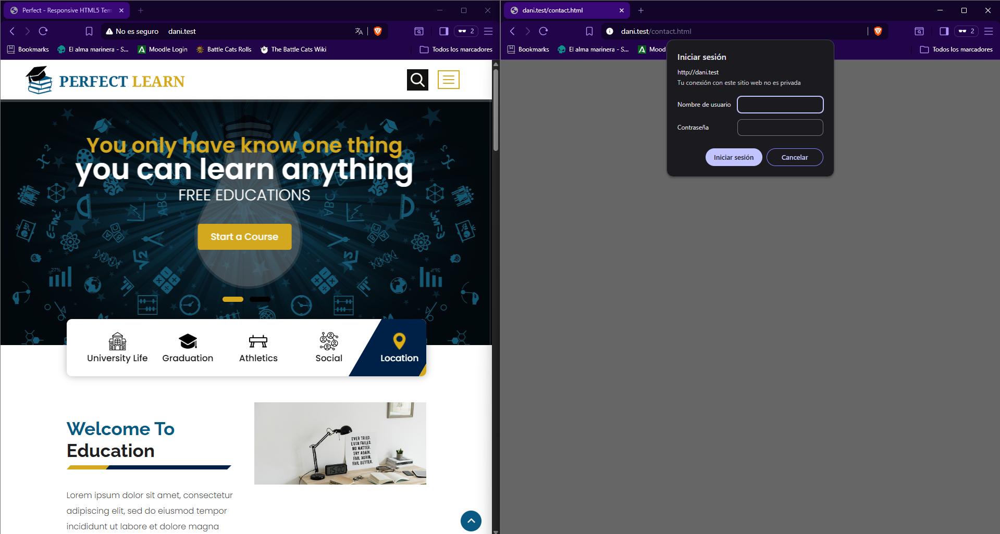
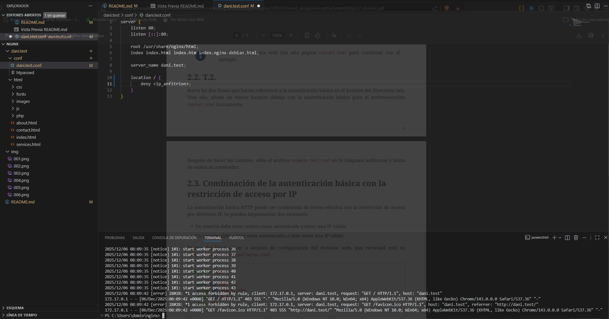
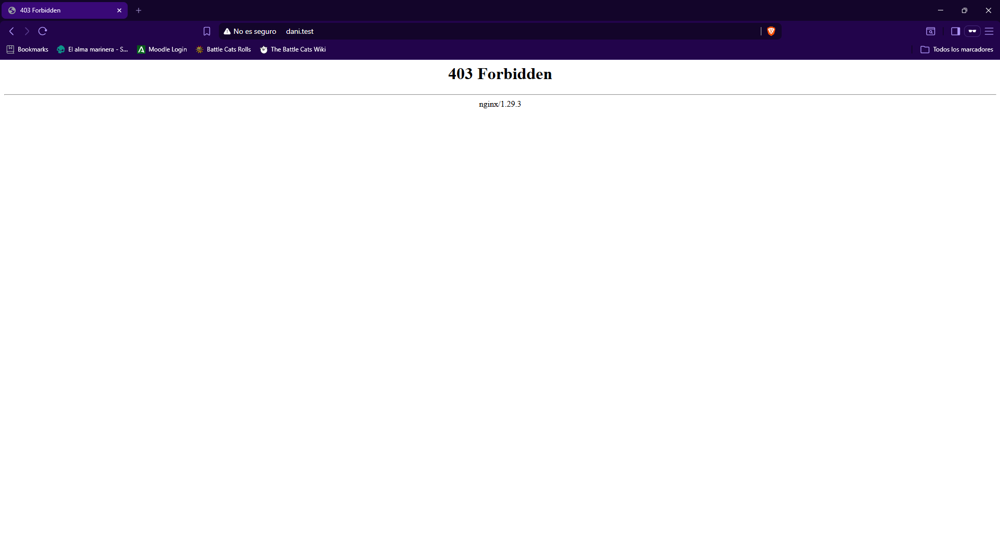
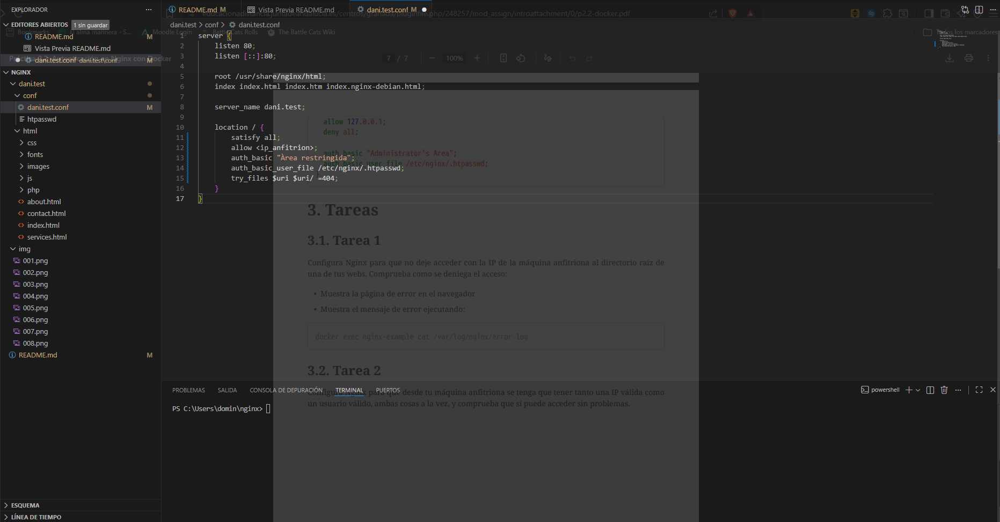
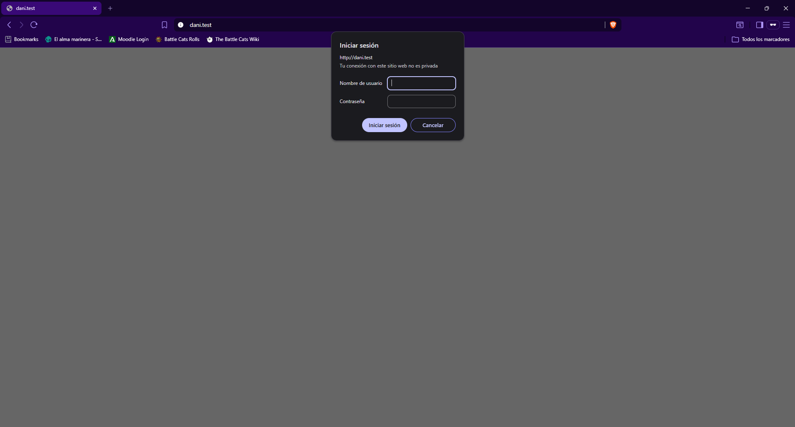

# Autenticación en Nginx con Docker

## Instalación de paquetes necesarios

### Creación de usuarios y contraseñas para el acceso web

### Configurando el contenedor Nginx para usar autenticación básica

### Probando la nueva configuración

¡Recuerda cambiar "~" por "C:/Users/[usuario]" si estás en Windows!  
Comando: docker run -d --name nginx-dani -p 80:80 -v ~/nginx/dani.test/html:/usr/share/nginx/html -v ~/nginx/dani.test/conf/htpasswd:/etc/nginx/.htpasswd -v ~/nginx/dani.test/conf/dani.test.conf:/etc/nginx/conf.d/default.conf nginx:latest

## Tarea 2

### 2.1 - Logs

### 2.2 - Restricción independiente

## Tarea 3

¡Importante: Cambia la IP de la configuración por la de tu anfitrión!
### 3.1 - Restricción por IP

#### Configuración

#### Error

### 3.2 - Restricción por IP y Usuario
¡El punto explicado en el apartado 2.3 es más o menos lo mismo que esto!

#### Configuración

#### Acceso sin problemas
